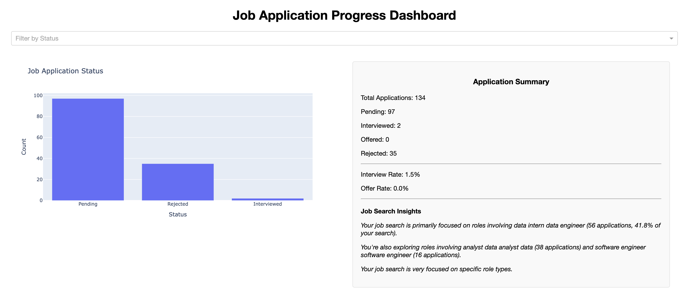
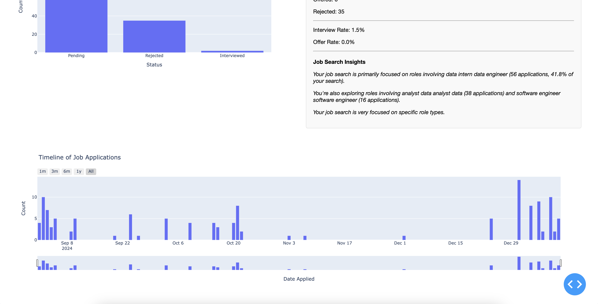

# Job Search Analytics and ProgressDashboard

## Overview
An interactive analytics dashboard built with Python and Dash that provides deep insights into your job application process. The dashboard leverages machine learning and NLP techniques to analyze application patterns, track progress, and provide meaningful insights about your job search journey. This dashboard can be adated to  any job search, however it is tailored to the tech industry.

## Screenshots


*Main dashboard showing application status distribution*


*Job application timeline showing application trends*


## Features

### Real-time Analytics
- Interactive filtering by application status
- Dynamic visualization of application trends
- Automated role pattern detection using NLP
- Application status distribution analysis

### Intelligent Job Analysis
- Automated role categorization using TF-IDF vectorization
- Clustering-based pattern detection
- Job search diversity insights
- Trend analysis and recommendations

### Visual Analytics
- Status distribution charts
- Timeline trend analysis
- Summary statistics
- Interactive date range selection

### User Experience
- Clean, modern interface
- Responsive design
- Real-time updates

## Technology Stack
- **Frontend**: Dash, HTML, CSS
- **Backend**: Python
- **Data Processing**: Pandas, NumPy
- **Machine Learning**: Scikit-learn
- **Analytics**: TF-IDF, K-means clustering

## Installation

1. Clone the repository:
```bash
git clone https://github.com/jaime-bustos/job-progress-dashboard.git
```

2. Navigate to the project directory:
```bash
cd job-progress-dashboard
```

3. Install the required dependencies:
```bash
pip install -r requirements.txt
```

4. Run the application:
```bash
python job_dashboard.py
```

5. Access the dashboard in your web browser at `http://localhost:8050`.

## Data Format Requirements

The application expects an Excel file (.xlsx) with the following columns:

### Required Columns
- **Job Title** (or similar): The title of the position (e.g., "Software Engineer", "Data Scientist")
  - Acceptable column names: "Job Title", "JobTitle", "Position", "Title", "Role", "Job"
- **Date Applied**: The application date in a format Excel recognizes as a date
- **Interviewed**: Binary indicator (0 or 1) for whether you received an interview
- **Offered**: Binary indicator (0 or 1) for whether you received an offer

### Example Format

| Job Title          | Date Applied | Interviewed | Offered |
|-------------------|--------------|-------------|---------|
| Software Engineer | 2024-01-15   | 1           | 0       |
| Data Scientist    | 2024-01-16   | 0           | 0       |
| Product Manager   | 2024-01-10   | 1           | 1       |

### Additional Notes
- The Excel file should be placed in the `src` directory
- Update the `your_file_name` variable in `job_dashboard.py` to match your Excel file name
- Dates should be in a consistent format throughout the sheet
- The analyzer automatically handles missing values and various job title formats
- For best results with the NLP analysis, keep job titles clear and consistent


## Contributing
Contributions are welcome! Please feel free to submit a Pull Request. For major changes, please open an issue first to discuss what you would like to change.

1. Fork the repository
2. Create your feature branch (`git checkout -b feature/AmazingFeature`)
3. Commit your changes (`git commit -m 'Add some AmazingFeature'`)
4. Push to the branch (`git push origin feature/AmazingFeature`)
5. Open a Pull Request

## Future Enhancements
- [ ] Industry sector analysis
- [ ] Salary range analytics
- [ ] Company size/type clustering
- [ ] Geographic distribution analysis
- [ ] Application success rate predictions
- [ ] Email notification system
- [ ] Multi-user support

## License
This project is licensed under the MIT License - see the [LICENSE](LICENSE) file for details.

## Acknowledgments
- Dash by Plotly for the interactive visualization framework
- Scikit-learn for machine learning capabilities
- The Python community for excellent data science tools

## Contact
Jaime Bustos - www.jaimebustos.com

Project Link: [https://github.com/jaime-bustos/job-progress-dashboard](https://github.com/jaime-bustos/job-progress-dashboard)

